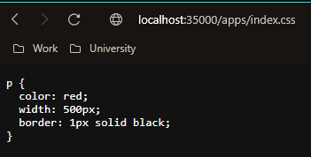
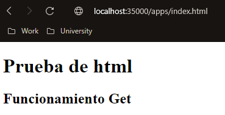
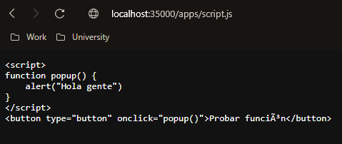
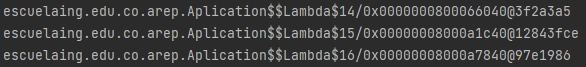
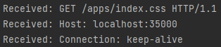

# Taller # 4
## ARQUITECTURAS DE SERVIDORES DE APLICACIONES

### Nombre: David Arturo Narváez Lossa

Para este taller los estudiantes deberán construir un servidor Web (tipo Apache) en Java. El servidor debe ser capaz de entregar páginas html e imágenes tipo PNG. Igualmente el servidor debe proveer un framework IoC para la construcción de aplicaciones web a partir de POJOS. Usando el servidor se debe construir una aplicación Web de ejemplo. El servidor debe atender múltiples solicitudes no concurrentes.### Requerimientos:

Tener instalado maven, entorno de desarrollo para el lenguaje (java) repositorio de git (https://github.com/Art2416/Aplicaciones-distribuidas-dise-o-y-estructuracion.git)

### Ejecución del programa

* Para ejecutar lo primero es clonar el repositorio (https://github.com/Art2416/Arquitecturas-de-servidores-de-aplicaciones.git).

`git clone https://github.com/Art2416/Arquitecturas-de-servidores-de-aplicaciones.git
`
* Poner en ejecución el servidor web ya sea desde mvn iniciando la clase (Aplicación).

`mvn install
`

`mvn compile exec:java -Dexec.args="escuelaing.edu.co.arep.Aplication"
`
* Ingresar desde el navegador (mozila preferiblemente).
* En la barra de búsqueda ingresar http://localhost:35000
* Para ingresar a cada uno de los servicios creados ingrese:
    1. http://localhost:35000/apps/index.html
  2. http://localhost:35000/apps/index.css
  3. http://localhost:35000/apps/script.js
* En cada uno de estos se está empleando funcionamiento del get con la función lambda  
## Ejecuciones 

### Información adicional

* la documentación se puede generar desde maven con su respectivo comando
* El diseño del software es extensible tanto en funcionalidades como en realizar consultas a otra API o implementacion de nuevos servicios
* Emplea patrones (Singleton)
* Emplea principios (Single responsability)
